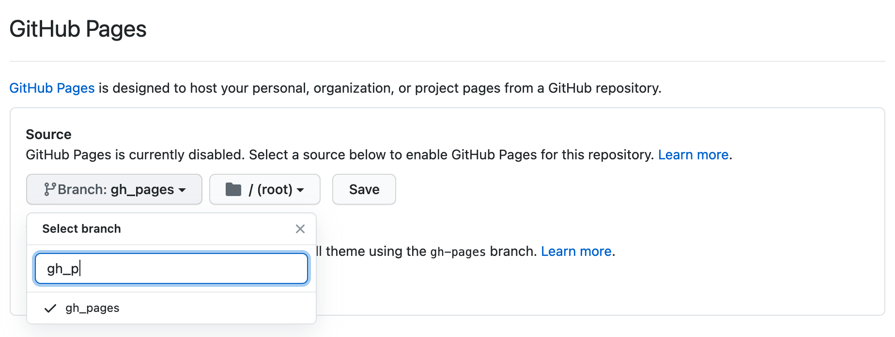
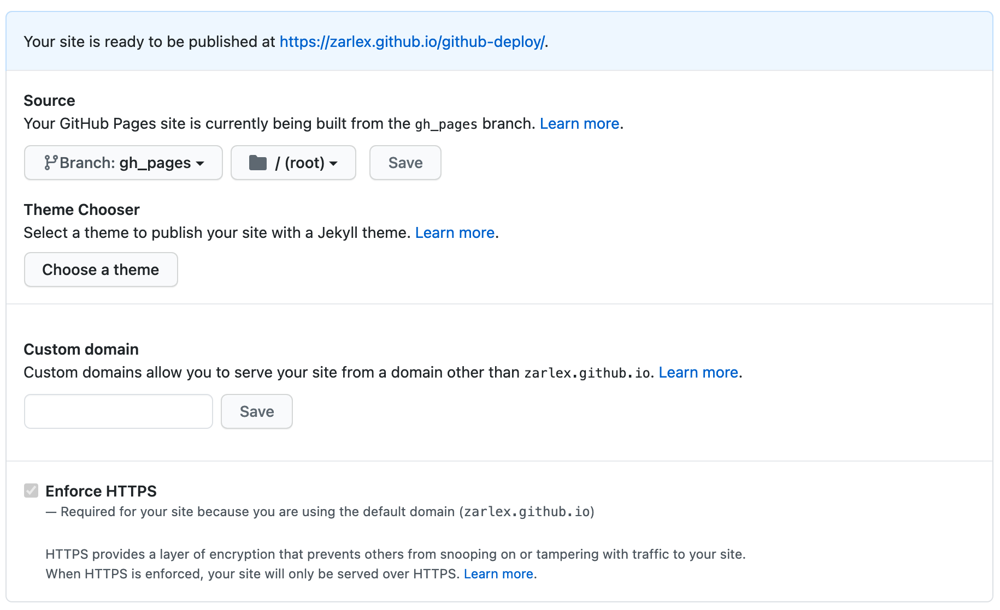

# github-deploy
Sample repo to demonstrate how to use github actions to host your PWA for free

## Tldr
- Within your top level projects folder create a folder `.github` with the sub directory workflows
- Place the file `deploy.yml` in order to setup the github workflow
- Copy and paste the boiler plate from [here](.github/workflows/deploy.yml) and adjust the build instructions under `Install and Build > run`
- Activate `GitHub Pages` in order to allow public access of your deployment. Go to 
  `https://github.com/{username}/{repo_name}/settings` and go to the section GitHub Pages. Select gh-pages as source branch


## Manual process
The following steps are necessary to host a static website on github. Static means that GitHub will serve a public
directory with static files (html, css, js, images, ...). You can not run a server with it so no php files or whatsoever.

1. Before you start make sure you have committed all changes otherwise they are lost

2. Create an orphan gh-pages branch. Orphan means that the branch is not related to your main branch anymore so it has its own version history.
   ```bash
   git checkout --orphan gh-pages
   ```
3. Remove all files in it and stage the changes. The option —update makes sure that only updates will be staged and not untracked file like the option —all would do
   ```
   rm -rf ./*
   git add —update
   ```

4. Create an index.html file
   ```html
   <html>
   <head>
     <title>Test</title>
   </head>
   <body>
     <h1>Hello Friends</h1>
   </body>
   </html>
   ```
5. Commit file and push it
   ```bash
   git add index.html
   git commit -m 'Init hello word'
   git push origin gh-pages 
   ```

6. Go back to the main branch and reset it to the previous state
   ```
   git checkout main
   Git reset —hard origin/main


7. Go to the settings page of your repo `https://github.com/{username}/{repo_name}/settings` and go to the section
   `GitHub Pages` and enable it by selecting it as source branch
   

8. GitHub shows a message that your gh-pages branch file content is now publicly available `https://{username}.github.io/{repo-name}`
   

## Automate this
Of course, you do not want to do all those steps everytime you change something. So now we are going to automate this.
To do so, we set up a github workflow which shall do all those steps everytime we push our changes to the main branch.

1. First, we create a source folder on the main branch were we put our index.html with the content from before.
2. Then we create a directory `.github` with a subdirectory called `workflows`
3. In workflows directory we place a file called `deploy.yml` (you can also give it a different name). In this file
we define our workflow. You can [checkout the file](.github/workflows/deploy.yml).
4. It defines 3 steps:
   
    - Checkout, which checks out test latest master revision
    - Build, which can run tasks in order to build your app. For demonstration purposes,
      we simply just copy all files from `src` to `dist`. Of course you can also do more sophisticated stuff here like bundling
      your JavaScript files, compile SCSS files to CSS and so on.
    - Deploy, this is basically what we did before. Luckily, we do not have to write anything for that but can just use 
      an available action provided by [JamesIves](https://github.com/JamesIves/github-pages-deploy-action)
 5. Last but not least we simply commit all our chages and push them to our main branch
    ```bash
    git add .github/ src/
    git commit -m 'Setup workflow and provide hello world content'
    git push origin main
    ```
 6. You can go the actions tab of you repository where you can now see your workflow being executed
    
    
 7. That is it! Now, everytime you push something to the main branch it will be automatically deployed and becomes publicly
available under you gh-pages url (https://zarlex.github.io/github-deploy/)
    
## Serve project with custom domain
For this we need to purchase a domain name e.g. on https://gandi.net
### APEX domain (example.com)
Create the following DNS records.
````
@ 1800 IN A 185.199.108.153
@ 1800 IN A 185.199.109.153
@ 1800 IN A 185.199.110.153
@ 1800 IN A 185.199.111.153
www 10800 IN CNAME {username}.github.io.
````
Make sure to replace `{username}` with your GitHub username.

### Subdomain (name.example.com)
Create the following DNS records
```
### Subdomain (name.example.com)
@ 1800 IN A 185.199.108.153
@ 1800 IN A 185.199.109.153
@ 1800 IN A 185.199.110.153
@ 1800 IN A 185.199.111.153
name 10800 IN CNAME {username}.github.io.
```

In order to use our custom Apex or Subdomain name we go back to your GitHub repository and switch to the gh-pages branch. There we need to create a file called CNAME . The content of the file is our apex or subdomain domain name. In my case it is github-deploy.zarg.es


Thats it. Now your project is available under your custom domain. Be aware that it takes several hours until the created DNS Records take some time until they take effect.


